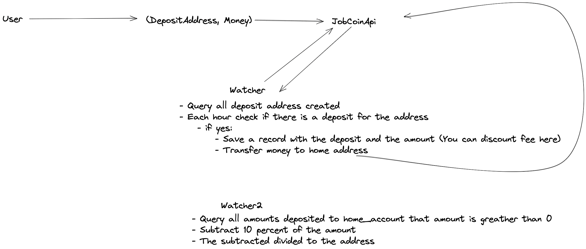

# Scala Jobcoin
Simple base project for the Jobcoin project using Scala and SBT. It accepts return address as arguments and prints out a deposit address to the user for them to send their funds to. The rest of the application is left unimplemented.

### Run
`sbt run`


### Test
`sbt test`

### Thinking process:

1. All coins transactions are public (Everyone can see all the transactions). This is reason of why the mixer is important.
2. The mixer will deposit the coins into different addresses associated with the main address so we can hide user transactions.
3. I change the fee and distribution logic of the mixer:
    
    3.1 Fee is calculated as follows:
     - Taking the 30% of the total deposited to the home_address.
     - Example:
      - Deposited amount 30
      - fee = 30 * .3 = 9
      
    3.2 Distribution to user's addresses:
     - Subtract the fee from the total deposited to the home_account to get a new deposit amount.
     - The amount to be deposited to the addresses is calculated by dividing the new deposit amount by 10.
     - Example:
        - Deposited amount 30
        - new_deposit_amount = 30 - (30 * .3) = 21
        - small_deposit = 21 / 10 = 2.1
        - The mixer will deposit 2.1 to each address until the 10 deposits are done.

**NOTE:**
```
This is a straightforward solution, but this will not make
smaller deposit if the original deposit amount is bigger.

This could be improved by extracting the number of digits of
the number and diving the deposit amount by the number of digits + 1. Example:

5 divide by 10 = 0.5
20 divided by 100 = 0.2
300 divided by 1000 = 0.3

Keep in mind that small deposits also mean that it will
take more time to deposit, so the new suggested algorithm
has a bigger time complexity, but it achieves the goal
of small deposits: T = O(N), where n is the number of digits.

```



### Tests:

#### Sent 30 from Diego to a307c51f-14af-4e86-b49b-f2007df71f32

**Addresses:**
 - q1zAGFiGj4: Mixer sent 8.4
 - xBOQnWSiFv: Mixer sent 6.3
 - 4MZv1kRdAf: Mixer sent 6.3

**Total:**
21

**Fee for mixer:**
9

#### Sent 30 from Diego to 1797afa2-b023-4681-9ca7-7e9ddfe34695

**Addresses:**
 - gGJHXl8q0J: Mixer sent 8.4
 - XgmskumT4G: Mixer sent 6.3
 - 5sRB4xP8zY: Mixer sent 6.3

**Total:**
21

**Fee for mixer:**
9

#### Sent 30 from Diego to 67b4dfa4-91ed-4b9b-97ec-b0c607df7cd0

**Addresses:**
 - sxsr7XtREh: Mixer sent 10.5
 - mkitCBdJZk: Mixer sent 10.5

**Total:**
21

**Fee for mixer:**
9

#### Sent 9 from Diego to 6fea3e54-c83d-4b67-97c3-8a7388f94956

**Addresses:**
 - YMULPgIjxj: Mixer sent 2.5200000000000004
 - 0rOFBdnDLG: Mixer sent 1.8900000000000003
 - 95XVufLRQN: Mixer sent 1.8900000000000003

**Total:**
6.3000000000000011

**Fee for mixer:**
2.7

**NOTE:**
I need to improve decimal precision

### Left items

- I would love to improve the exception handler since is 
difficult to track if the background processes are breaking
due to a client communication or a database exception.

- Add logback to add logs an help investigate issues.

- Add metrics to detect errors on production when something
is failing, detect bottle necks, etc.

- Improve the distribution logic since anyone can predict that
the mixer is doing small deposits in the order the addresses where inserted.
I could implement a random algorithm to do the small deposits instead.

- Implement dependency injection since I needed to pass
instances in all places.

- Create base client class to avoid duplicated code in the
HTTP clients.